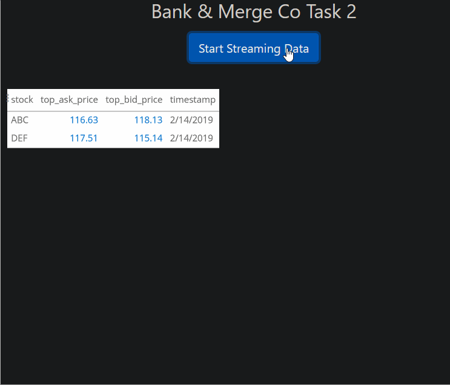

### What I did during JPMorgan Chase Virtual Internship:

Note: This file lists everything I learned and did during the virtual internship. To avoid plagarism I can't post my code on a public repo, unfortunately.

### Task 1
---

1. Set up environment, ran server and client according to the instructions.
2. I personally decided to use a Python virtual environment - there were packages I didn't want to install system wide. Also, it makes the code more portable.
3. The bid price was the same as the price of the stock, so changed it by:
    * modifying getDataPoint in client to return correct prices
    * modifying getRatio in client
    * modifying Main in client to print the correct prices.
4. Bonus Taks: Writing Unit Tests:
    * Use the "Build-Act-Assert" model
        * Build: a simulated scenario with dummy date
        * Act: Make operations and call on the function
        * Assert: Make sure that the ouptut matches the expectation we have.
    * I wrote some additional unit tests to test the code for when the price of top ask is zero, and for when the price of top bid is zero.
5. Wrote the Patch file:
    * patch files can be a pplied to a repo to get any code changes onto a local machine. This is great code hygeine, allowing you code to be checked before a merge.
    * Making the patch file:
        * S1: navigate to repo in bach.
        * S2: `git add -A`
        * S3: `git config user.email "<my_email_adress_in_full>"`
        * S4: `git config user.name "<my_name>"`
        * S5: `git commit -m 'Created Patch File'`
        * S6: `git format-patch -1 HEAD`

### Task 2 : TypeScript, Node.js, and other types of fun
---

1. In this task, I had to fix a stock interface:
2. The hardest part of this task was the setup, just debugging `npm install` and `npm start`.
    * I installed `nvm`, which is a version manager for node. For this task, I am using version 11.
    * After installing C++ Build tools for Visual Studio, I set the npm msvs version to 2017, which caused errors down the line.
    * After several dizzying errors, force cleaning the npm cache, then `npm prefix -g | % {npm config set node_gyp "$_\node_modules\node-gyp\bin\node-gyp.js"}`, then setting msvs version to 2019 was the solution!.
3. After having to wipe my hard drive for unrelated reasons, I was getting strange errors during `npm install` and `npm start` again. In the meantime, I had started using the absolutely lovely Windows Subsystem Linux. I decided to switch over to Linux.
    * to avoid issues, I aliased `python3` in Ubuntu to `python` by `alias python=python3`
        * after this, made sure to `source ~/.bashrc`
        * [source](https://askubuntu.com/questions/320996/how-to-make-python-program-command-execute-python-3)
4. After this, I installed Node, Npm, Nvm. (Node is a JavaScript runtime that executes JS code outside of a browser, Npm is a pakcage manager, Nvm is a node version manager).
    * [installation instructions for nvm, linux](https://github.com/nvm-sh/nvm#install--update-script)
5. After some more debugging, I tried everything from clearning npm cache with -f to rebuilding node-gyp manually, in the end I got the data to start streaming:

6. Then, I moved on to making changes to the code:
    * First, I need to make the graph continuously update so that it doesnt need to be clicked a bunch of times.
        * To do this, I modified `App.tsx`, (yay Typescript!)
        *
    * Then, I needed to remove any duplicate data.
    * 
